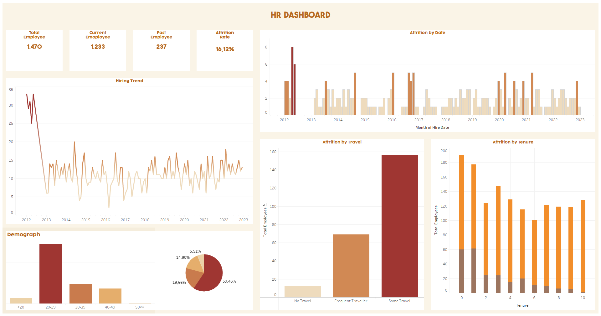

# HR Performance Analytics
---

## About
- Extract data from Kaggle with API
- Data Transformation and cleaning data with Pandas
- Load to Database with PostgreSQL
- Visualize to get insight with Tableau Public
- You can see step-by-step, explanation, and how the code works in [Notebook.ipynb](Notebook.ipynb).  
- You also can do Data Definition Language to define constraints Directly in SQL with [Keys.sql](Keys.sql).
- The dashboard is displayed in [Dashboard HR.twbx](Dashboard HR.twbx).

## Dashboard

