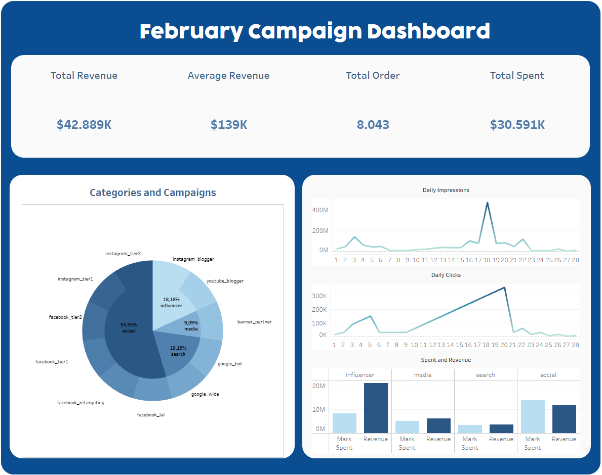
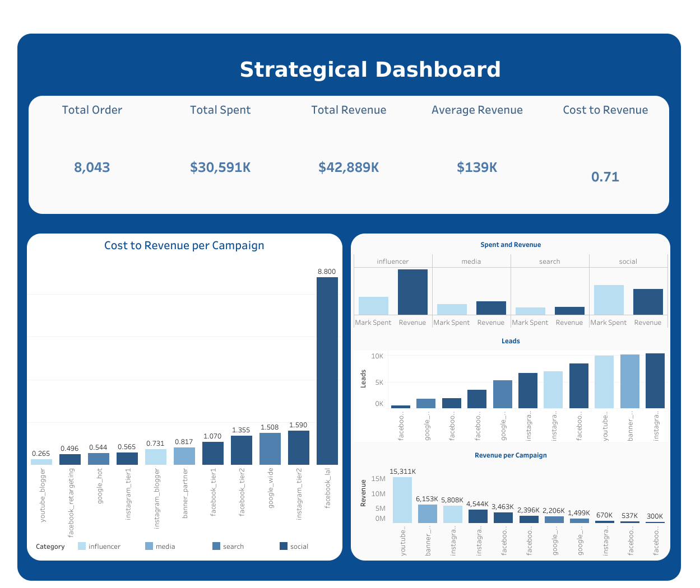

<<<<<<< HEAD
# Online Campaign Analysis
---

## About
- Extract data from Kaggle with API
- Data Transformation and cleaning data with Pandas
- Visualize to get insight with Tableau Public
- You can see step-by-step, explanation, and how the code works in [Notebook.ipynb](Notebook.ipynb).
- The dashboard is displayed in [Campaign Dashboard.twbx](Campaign%20Dashboard.twbx).
- You can see the raw data used for analysis in [Marketing.csv](Marketing.csv).

## Dashboard

=======
# Online Campaign Analysis
---

## About
- Extract data from Kaggle with API
- Data Transformation and cleaning data with Pandas
- Visualize to get insight with Tableau Public
- You can see step-by-step, explanation, and how the code works in [Notebook.ipynb](Notebook.ipynb).
- The dashboard is displayed in [Campaign Dashboard.twbx](Campaign%20Dashboard.twbx).
- You can see the raw data used for analysis in [Marketing.csv](Marketing.csv).

## Dashboard

>>>>>>> cb298015ef69cd87713ec43f652d0f4f4a1ba3a5
